# Scale Space Synthesist

A WebGPU phase-space visualizer / particle-based morphoscope. Part of the [Scale Space](https://reddit.com/r/ScaleSpace) project.

 

## Just run it

Open `dist/index.html` in a WebGPU-capable browser (Chrome / Edge / Brave / Safari 17.4+). Done. No install required.

## Edit it (any OS, no command line)

**Windows:** double-click `1-INSTALL.bat` once, then `2-DEV-MODE.bat` to edit, `3-MAKE-BUILD.bat` to ship.
**Mac:** same idea, use the `.command` files instead.

Full plain-English instructions are in `START-HERE.txt`.

## Edit it (command line)

```sh
npm install
npm run dev      # http://localhost:5173, hot-reload on save
npm run build    # produces dist/index.html (~1.15 MB, fully self-contained)
```

## What's inside

```
src/app.js     all application code, single file
src/app.css    all styles, single file
index.html     panel scaffolding
vite.config.js build config (vite-plugin-singlefile)
dist/          generated standalone build
```

`src/app.js` reads top-to-bottom in seven labelled sections — `APP_TEXT`, `AudioManager`, `Atlas`, `Engine`, `RadialUI`, `UI`, `Bootstrap`. Use Ctrl+F to jump around.

## Why a single source file

Original ask: editable by a designer, not just a developer. One file = no jumping between modules, no losing your place. Vite still bundles three.js + Tone.js + your code into a single self-contained HTML on build, so the deliverable is portable to anywhere a browser can read a file.

## Keyboard shortcuts

| Keys | Action |
|---|---|
| Tab | Hide/show UI |
| Home | Reset camera |
| Pause / P | Toggle simulation pause / toggle audio |
| PgUp / PgDn | Adjust tempo |
| Ctrl+S | Capture current configuration as a waypoint |
| Q / E | Free energy (particle count) |
| Z / X | Resolution (particle size) |
| R / T | Equilibrium (noise speed) |
| F / G | Temperature (noise intensity) |
| V / B | Coherence (attraction radius) |
| I / O | Inversion (compression) |
| N / M | Scale depth (attraction force) |
| K / L | Half-life (particle lifespan) |
| Right-click canvas | Open radial menu |

# Screenshots

All screenshots are unedited. Differences in scanlines and backgrounds come from settings in Scale Space Synthesist.


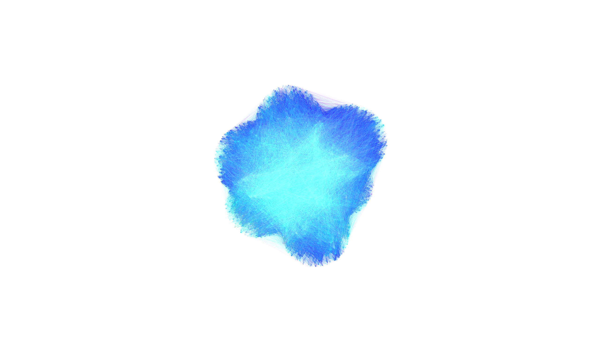
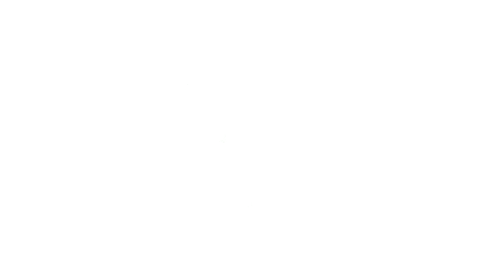

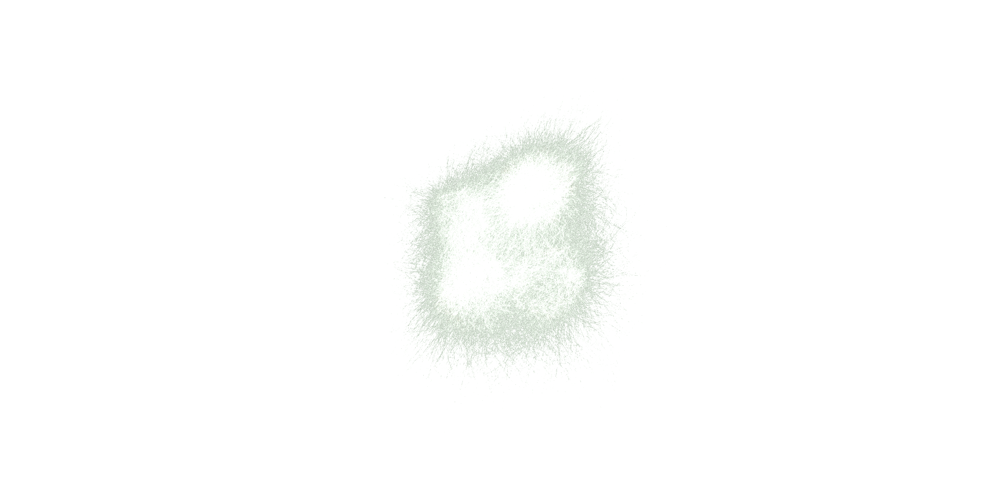


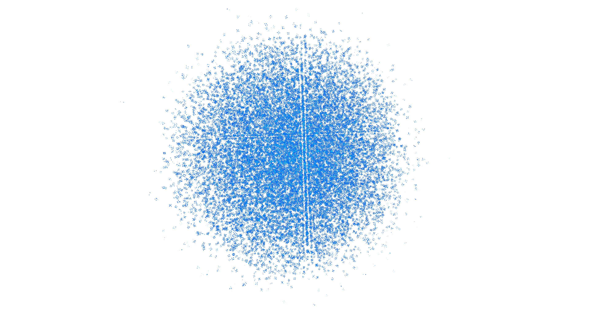

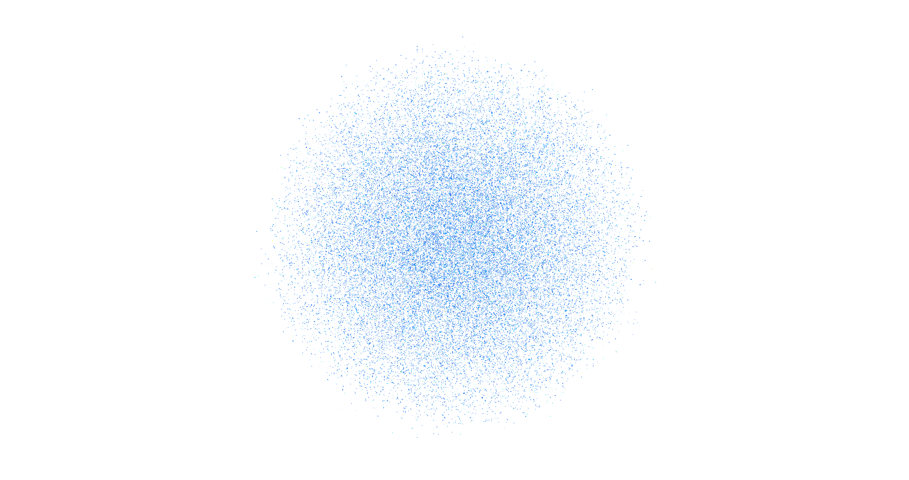
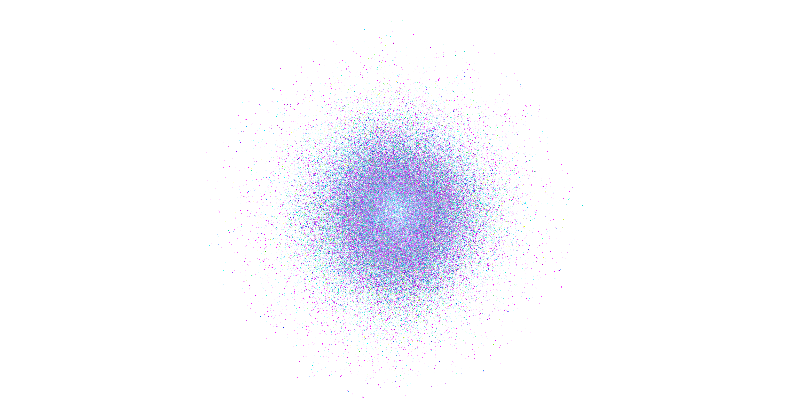

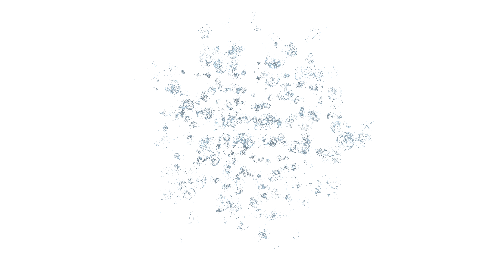


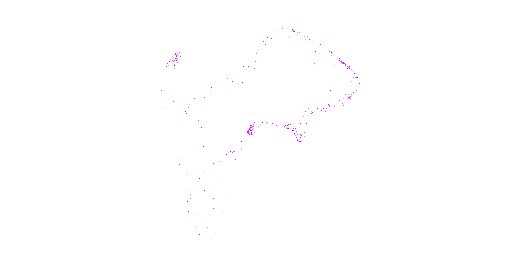


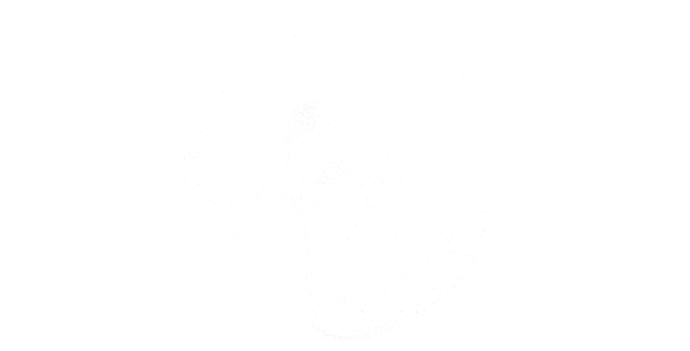


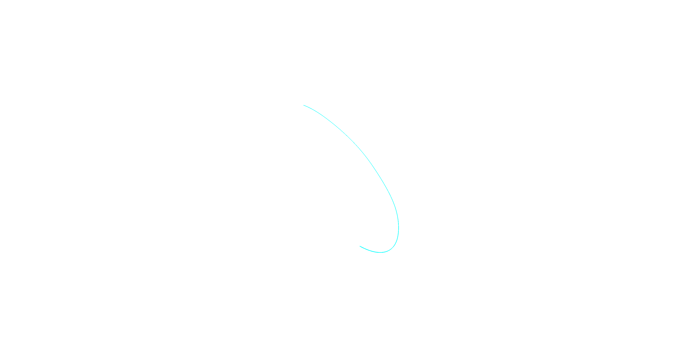


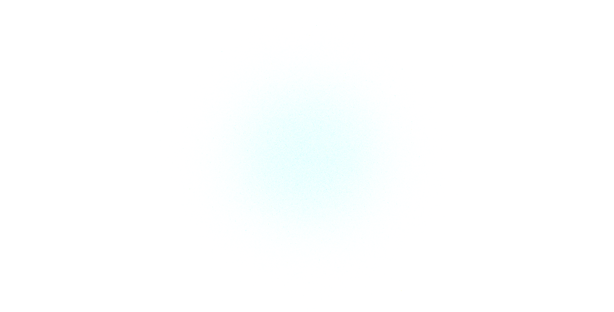
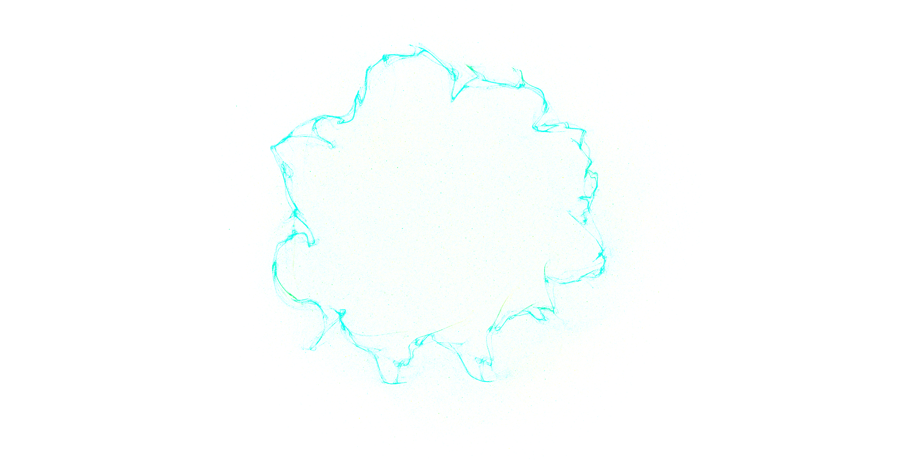


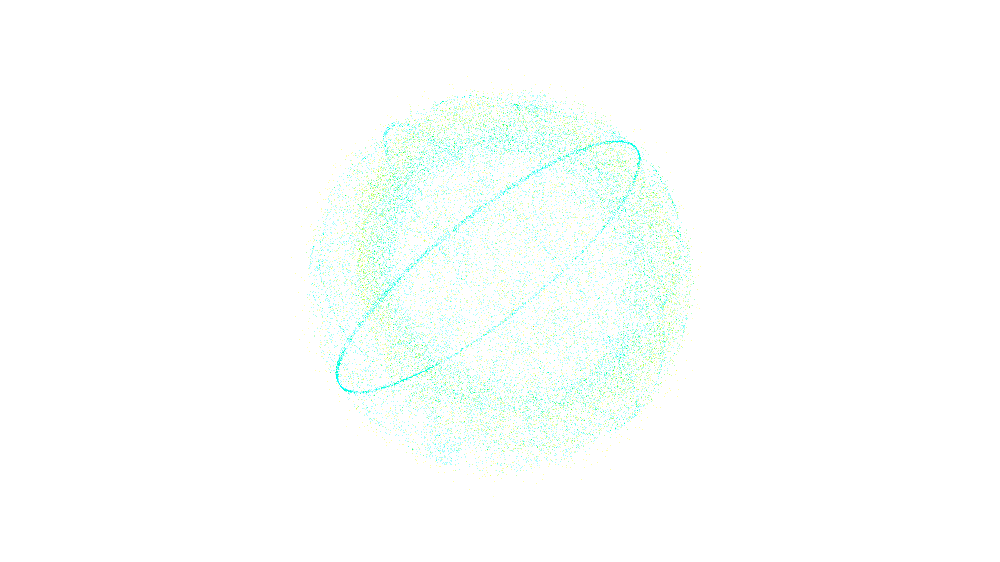

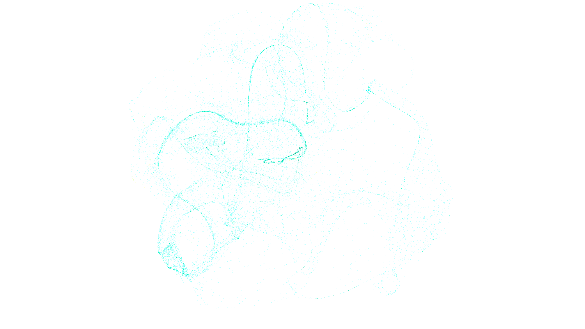
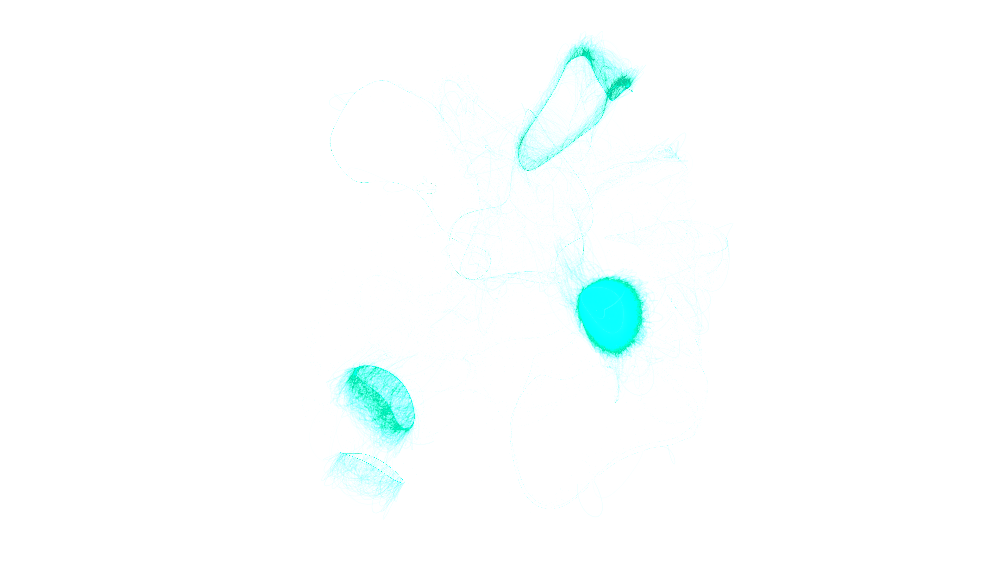


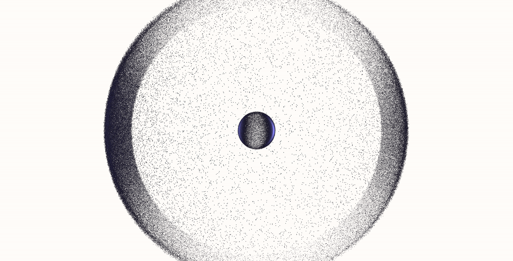
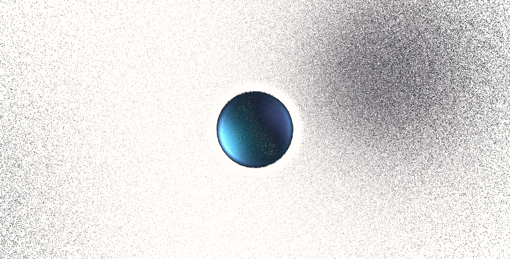


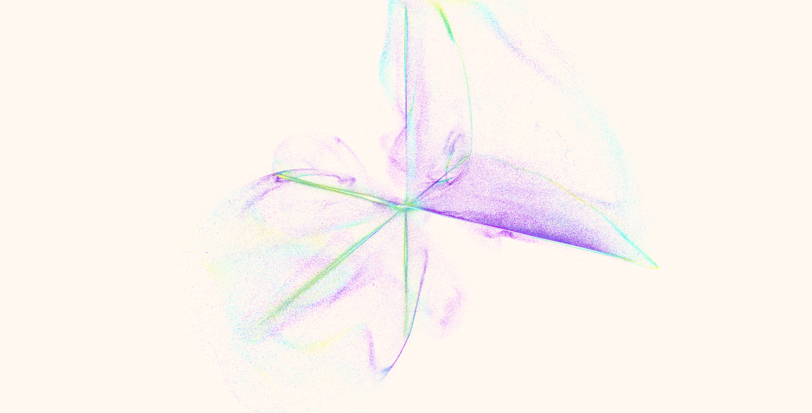

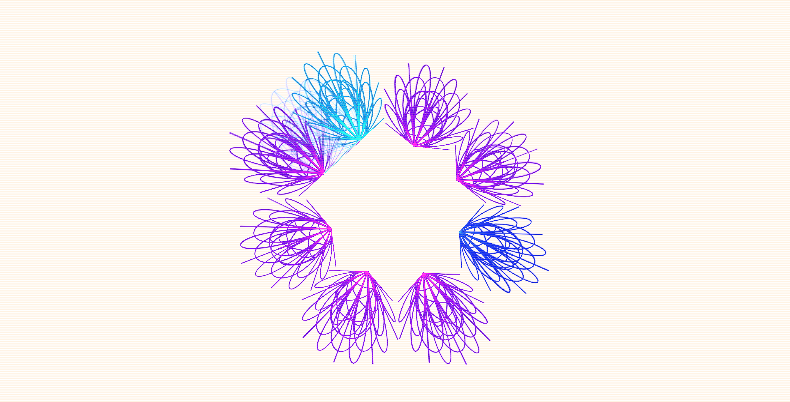


## Contributing

Thoughtful PRs welcome. Discussion and shared waypoints at [/r/ScaleSpace](https://reddit.com/r/ScaleSpace).

## License

MIT — see `LICENSE`.
